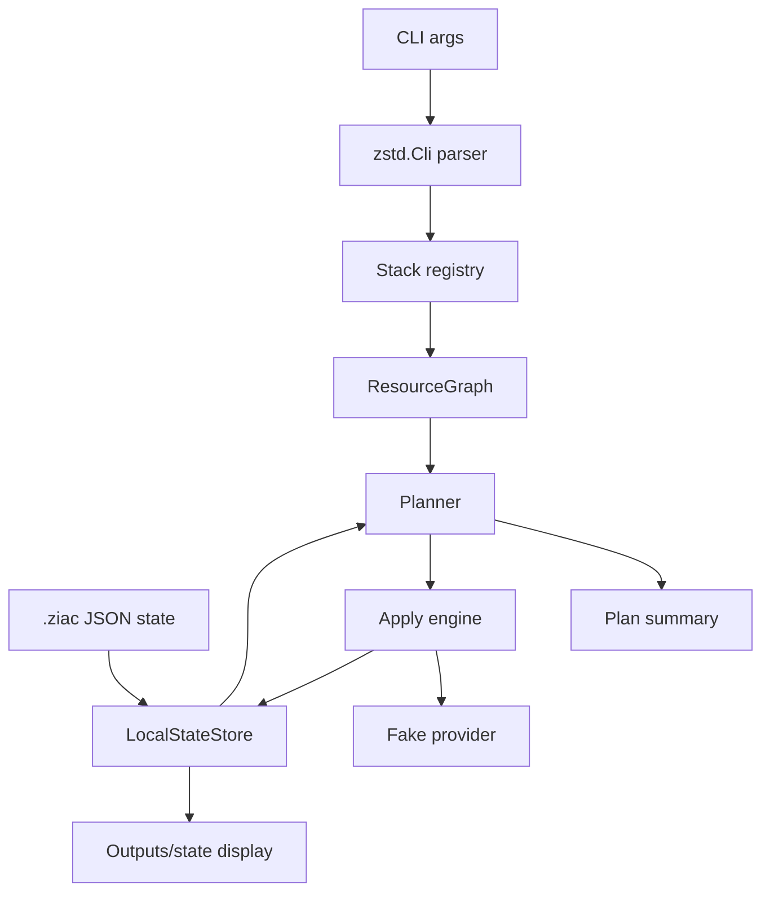

# Ziac Local CLI And State V1 Design

Date: 2026-06-27

Status: design approved in direction; written for review before implementation
planning.

## Context

Ziac now has its foundation package in `packages/ziac`:

- `core.zig` for names and diagnostics.
- `output.zig` for outputs and secret references.
- `resource.zig` for resource graphs and dependency validation.
- `state.zig` for state records and an in-memory store.
- `plan.zig` for deterministic `create` versus `noop` planning.
- `provider.zig` for the provider lifecycle interface and fake provider.
- `apply.zig` for applying a plan through a provider.

The next phase should make that foundation usable from a terminal without
touching live GCP. This gives Ziac a real developer loop before the GCP provider
and global Cloud Run components arrive.

## Selected Approach

Build a local CLI and JSON state store first.

The first CLI should use `zigeffect_std` for command parsing, deterministic JSON
helpers, file-system access, secret redaction, and testable console output. It
should run entirely against the existing fake provider and a fixture or
registered stack program. Loading arbitrary user Zig stack files is intentionally
deferred until the command loop, state semantics, and output behavior are
stable.

Rejected alternatives:

1. Start with comptime `App.Env` validation.
   This is more distinctive, but it is harder to demonstrate without a command
   loop and state lifecycle.
2. Start with live GCP provider work.
   This is exciting, but it would mix cloud authentication, API drift, and state
   semantics too early.

## Goals

1. Provide a `ziac` executable target.
2. Add a testable CLI module behind the executable.
3. Support `ziac plan`, `ziac deploy`, `ziac destroy`, `ziac outputs`, and
   `ziac state`.
4. Persist local state as deterministic JSON under `.ziac/state/<stack>/<stage>`.
5. Keep secrets redacted in command output and state display.
6. Run commands through the fake provider so plan/apply behavior is observable
   without live cloud credentials.
7. Make the CLI suitable for future GCP, CockroachDB, and stack-loading work
   without baking those concerns into V1.

## Non-Goals

1. No live GCP calls.
2. No CockroachDB provider calls.
3. No dynamic loading of arbitrary Zig stack files.
4. No remote state locking.
5. No drift detection against live infrastructure.
6. No generated container images.

## Product Shape

The first happy path should feel like this:

```sh
ziac plan --stack hello-global --stage dev
ziac deploy --stack hello-global --stage dev
ziac outputs --stack hello-global --stage dev
ziac destroy --stack hello-global --stage dev
```

For V1, `hello-global` can resolve to a package-local fixture stack registered in
tests and examples. The point is to prove the shape of the loop:

1. Resolve stack and stage.
2. Build a resource graph.
3. Load local state.
4. Build a deterministic plan.
5. Print a redacted plan summary.
6. Apply through a fake provider for deploy or destroy.
7. Persist state.
8. Print outputs.

## Architecture

### `cli.zig`

Owns command specs, argument decoding, command dispatch, and command receipts.
It should use `zstd.Cli` and `zstd.Console` rather than ad-hoc argument parsing
or direct stdout writes.

Public surface:

```zig
pub const Command = enum { plan, deploy, destroy, outputs, state };
pub const Args = struct { stack: []const u8, stage: []const u8 };
pub fn runCli(allocator: std.mem.Allocator, args: []const []const u8, env: CliEnv) !u8;
```

The exact type names may change in implementation, but the boundary should stay
testable: tests pass arguments and fake services in, then inspect console output
and state writes.

### `local_state.zig`

Owns local JSON persistence for `StateRecord` values.

Path layout:

```text
.ziac/state/<stack>/<stage>/resources.json
.ziac/state/<stack>/<stage>/outputs.json
```

`resources.json` stores all resource records for one stack/stage in stable order.
`outputs.json` stores redacted output metadata and non-secret output values.
Secret values must not be written as plain text.

V1 can use a whole-file read/write strategy. Locking and append-only journals are
future work.

### `stack_registry.zig`

Provides the V1 bridge between CLI commands and resource graph construction.
This is intentionally not a dynamic stack loader.

The registry should support package-local fixtures and tests:

```zig
pub const StackFactory = *const fn (allocator: std.mem.Allocator, args: StackArgs) anyerror!StackProgram;
pub fn fixtureRegistry() StackRegistry;
```

This lets `ziac plan --stack hello-global --stage dev` exercise real graph,
plan, state, provider, and output logic while leaving user stack loading for a
separate spec.

### `main.zig`

Thin executable wrapper. It should allocate, pass process args to `cli.zig`, and
return the mapped exit code. It should not own business logic.

## Command Semantics

### `ziac plan`

Loads the stack graph and local state, builds a plan, validates the graph, and
prints operations in stable order.

Output should include:

```text
Stack: hello-global
Stage: dev
Plan: 1 create, 0 update, 0 delete, 0 noop
+ gcp.run.Service api
```

No state mutation occurs during `plan`.

### `ziac deploy`

Builds a plan and applies `create`, `update`, and `replace` operations through
the fake provider. It writes local state after successful operations and marks
failed resources as `failed` if the provider returns an error.

V1 does not need partial rollback. It should preserve enough state for the user
or a future command to see what failed.

### `ziac destroy`

Uses local state to build delete operations for managed resources. It applies
delete operations through the fake provider and then marks resources as
`deleted`.

V1 can leave deleted records in state. Physical removal and tombstone compaction
are future work.

### `ziac outputs`

Reads local output state and prints stable key/value lines. Secret outputs print
`[REDACTED]`.

### `ziac state`

Prints a compact resource-state table:

```text
gcp.run.Service.api  created
```

This command is for local debugging and test visibility.

## Data Flow



## Error Handling

Errors should map to stable exit codes:

1. Invalid CLI usage: `2`.
2. Missing stack fixture: `3`.
3. Invalid graph or dependency cycle: `4`.
4. State read/write failure: `5`.
5. Provider apply failure: `6`.

Human-facing diagnostics should include the stack and stage when available.
Secrets must pass through `zstd.Secrets` or an equivalent redaction helper before
display.

## Testing Strategy

Use `zig build test` and keep the same TDD style as the foundation.

Required tests:

1. CLI parser accepts `plan`, `deploy`, `destroy`, `outputs`, and `state`.
2. `plan` prints stable operations and does not write state.
3. `deploy` creates local state through the fake provider.
4. `deploy` provider failure marks the resource failed and returns the expected
   exit code.
5. `destroy` marks existing resources deleted.
6. `outputs` redacts secret values.
7. JSON state read/write round-trips records in stable order.
8. `main.zig` remains a thin wrapper over `cli.zig`.

Root verification should include:

```sh
bun run ziac:test
bun run ziac:examples
bun run zigeffect:std:test
git diff --check
```

`bun run zigeffect:test` should be run before merge because Ziac depends on the
engine through `zigeffect_std`.

## Acceptance Criteria

1. `packages/ziac` builds a `ziac` executable.
2. `zig build test` covers CLI, local state, and fake apply flows.
3. `zig build examples` exercises at least one local CLI path.
4. `ziac plan` can show a deterministic plan for the fixture stack.
5. `ziac deploy` can persist local JSON state for the fixture stack.
6. `ziac outputs` never prints secret values in plain text.
7. No live cloud credentials are required.
8. The implementation remains ready for later GCP and CockroachDB provider work.
