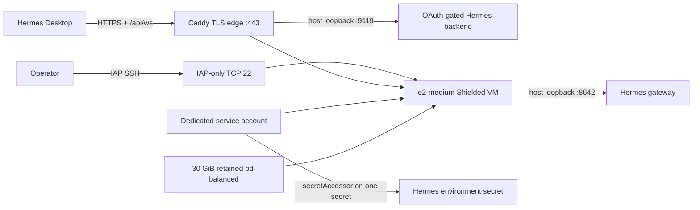

# Hermes Agent On Compute Engine

`gcp.HermesCompute` is Ziac's first M84C third-party compatibility component. It
deploys the official NousResearch Hermes Agent container to one inexpensive,
persistent Google Compute Engine VM and gives Hermes Desktop a stable,
OAuth-gated HTTPS backend.

This is a compatibility application, not Ziac's core engine health check. The
Ziac-owned provider canary and global E2E remain the release diagnostics; Hermes
proves that a normal external application can use the same public graph,
provider, state, plan, dashboard, and evidence boundaries.

## Topology



With Cloud DNS enabled, the component creates twelve resources: a custom VPC,
subnet, reserved regional address, IAP SSH firewall, public TLS-edge firewall,
service account, Secret Manager secret and version, one secret IAM member,
balanced boot disk, VM, and DNS `A` record. There is no project-level runtime
role and no firewall rule for ports 8642 or 9119. Only 80 and 443 are public.

## Why This Default

The default `e2-medium` exposes two shared-core vCPUs, sustains one aggregate
vCPU, and supplies four GiB of memory. That matches the official Hermes Compose
memory budget while avoiding the cost of a full two-vCPU VM. Use
`e2-standard-2` when concurrent tool calls, heavier local processes, or a larger
operator workload matter more than the lowest sensible price.

The VM has a reserved regional external IPv4 address for outbound model calls
and stable DNS. Caddy provides automatic TLS on the same VM, avoiding the fixed
cost and resource count of an external Application Load Balancer for this
single-instance compatibility lane. Administrative access remains restricted to
Google's IAP TCP forwarding range. The cost estimate must include:

- E2 compute time;
- 30 GiB balanced persistent disk;
- the in-use external IPv4 address;
- network egress, logging, Secret Manager access, and model-provider charges.

At current public list prices, `e2-medium` is roughly a mid-twenties USD monthly
compute commitment when continuously running in common European regions, before
disk, IPv4, egress, tax, or discounts. Treat the dashboard value as a
configuration estimate until billing export is connected. Stop the VM when an
always-on agent is unnecessary; do not use Spot for persistent operator state.

## Application Secret

Create a local file readable only by your account. It uses Docker `--env-file`
syntax and may contain the provider and integration variables Hermes supports:

```text
OPENAI_API_KEY=replace-me
```

Load it without printing the value:

```sh
chmod 600 "$HOME/.config/hermes/ziac.env"
export HERMES_ENV_FILE="$(<"$HOME/.config/hermes/ziac.env")"
export ZIAC_HERMES_STARTUP_SCRIPT="$(<scripts/hermes-compute-startup.sh)"
```

Ziac stores only the `env:HERMES_ENV_FILE` reference in the graph and state. The
provider resolves the bytes when creating a Secret Manager version. The VM
metadata identity then reads that one secret at boot. Neither payload is written
to VM metadata, plan JSON, state, logs, or qualification receipts.

## Stack

[`examples/hermes_compute.zig`](../examples/hermes_compute.zig) is a complete
external-project stack implementation. Use it as `ziac.stack.zig` in a project
created by `ziac init`, then set the project manifest's stack and dashboard stack
to `hermes`.

The default protected stack is equivalent to:

```zig
var hermes = try ziac.gcp.HermesCompute.build(allocator, provider, .{
    .name = "hermes",
    .region = "europe-west1",
    .zone = "europe-west1-b",
    .domain = "hermes.example.com",
    .dns_zone = "example-com",
    .oauth_client_id = "agent:registered-client-id",
    .environment_source = .{
        .provider = "env",
        .resource = "HERMES_ENV_FILE",
        .version = "1",
    },
    .startup_script = .known(.{
        .provider = "env",
        .resource = "ZIAC_HERMES_STARTUP_SCRIPT",
        .version = "1",
    }),
    .startup_script_sha256 = ziac.gcp.hermes_compute.reviewed_startup_script_sha256,
});
```

Compile and deploy through the normal external-project path:

```sh
export ZIAC_GCP_PROJECT="my-project-id"
export ZIAC_HERMES_REGION="europe-west1"
export ZIAC_HERMES_ZONE="europe-west1-b"
export ZIAC_HERMES_IMAGE="nousresearch/hermes-agent:v0.18.2"
export ZIAC_HERMES_DOMAIN="hermes.example.com"
export ZIAC_HERMES_DNS_ZONE="example-com"
export ZIAC_HERMES_OAUTH_CLIENT_ID="agent:registered-client-id"

ziac check --stack hermes --stage dev
ziac plan --stack hermes --stage dev --provider gcp --out .ziac/hermes.plan.json
ziac deploy --stack hermes --stage dev --provider gcp --plan .ziac/hermes.plan.json
```

`latest` and untagged images are rejected. A release tag is convenient; an
`@sha256:` image digest is the stronger production choice.

## OAuth And Desktop Access

Before deployment, register a Hermes dashboard OAuth client in the Nous Portal
or with `hermes dashboard register`. Its redirect URI must be the exact public
callback:

```sh
hermes dashboard register \
  --name ziac-hermes \
  --redirect-uri "https://hermes.example.com/auth/callback"
```

After deployment, open **Settings -> Gateway -> Remote gateway** in Hermes
Desktop and enter the component's `desktop_url`, for example
`https://hermes.example.com`. Choose **Sign in with Nous Research**, finish the
browser login, then save and reconnect. The desktop shell uses the authenticated
REST surface and `/api/ws`; no session token or SSH tunnel is copied into the
app.

IAP remains the recovery path for an operator with OS Admin Login. It can also
open temporary local tunnels for diagnosis, but it is no longer the product
connection path. Never add public firewall ports for 8642 or 9119.

## Updates And Recovery

- **Hermes update:** set an explicit newer tag or digest, review the plan, and
  deploy. The VM metadata change is visible and auditable.
- **Secret rotation:** update `HERMES_ENV_FILE`, deploy the new secret version,
  then stop/start the VM so the startup script reads `versions/latest`.
- **Guest failure:** inspect `/var/log/ziac-hermes-bootstrap.log`,
  `systemctl status docker`, `docker logs hermes`, and `docker logs hermes-edge`
  over IAP. Redact application logs before attaching them to evidence.
- **Resize:** change `ZIAC_HERMES_MACHINE_TYPE` to `e2-standard-2`; review the
  replacement or stop/update behavior reported by the provider.
- **Data:** `/opt/data` is on the retained boot disk. Snapshot it before risky
  changes. Instance destroy does not delete the disk in the protected default.
- **Cleanup:** explicitly remove lifecycle protection and retention, review the
  delete plan, and use `ziac destroy --confirm`.

## Authenticated Qualification

The M84C live runner is intentionally destructive and accepts only a project
whose ID ends in `-ziac-disposable`:

```sh
export ZIAC_HERMES_WORKSPACE="/path/to/initialized/hermes-project"
export ZIAC_LIVE_PROJECT="team-hermes-ziac-disposable"
export ZIAC_HERMES_REGION="europe-west1"
export ZIAC_HERMES_ZONE="europe-west1-b"
export ZIAC_HERMES_IMAGE="nousresearch/hermes-agent:v0.18.2"
export HERMES_DOMAIN="hermes-qualification.example.com"
export HERMES_DNS_ZONE="example-com"
export HERMES_OAUTH_CLIENT_ID="agent:qualification-client-id"
export ZIAC_HERMES_DESTRUCTIVE_CONFIRMATION="QUALIFY_DISPOSABLE_HERMES_COMPUTE"

bash scripts/qualify-hermes-compute.sh
```

The runner verifies the startup digest, deploys a cleanup-enabled graph, probes
the IAP recovery route and localhost listeners, verifies valid public TLS and
the advertised Nous OAuth provider, proves an unauthenticated WebSocket cannot
upgrade, restarts the VM, checks URL stability and a no-op plan, destroys the
graph, and requires an empty inventory. Missing credentials produce an explicit
skip; they never produce a passing cloud receipt.

## Deliberate Limits

This first compatibility lane is one VM in one zone. It is not highly available,
does not run local foundation models, and does not expose nested Docker. The
desktop endpoint is public only through TLS and Hermes' mandatory OAuth gate.
Managed-instance-group, GPU, private-VPN, and load-balanced variants remain
separate architectures if real usage demands them.

References: [Hermes Docker guide](https://github.com/hermes-agent/hermes-agent/blob/main/website/docs/user-guide/docker.md),
[Hermes Desktop remote backend guide](https://github.com/hermes-agent/hermes-agent/blob/main/website/docs/user-guide/desktop.md#connecting-to-a-remote-backend),
[Google E2 machine types](https://docs.cloud.google.com/compute/docs/general-purpose-machines),
[IAP TCP forwarding](https://cloud.google.com/iap/docs/using-tcp-forwarding),
and [Caddy automatic HTTPS](https://caddyserver.com/docs/automatic-https).
